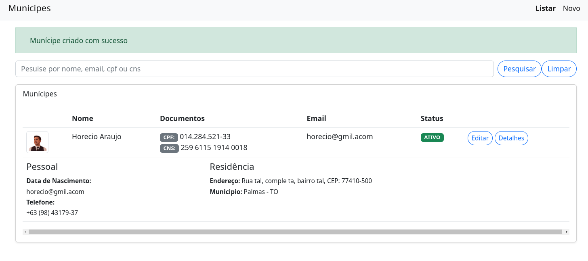

### Versions
 - Ruby 3.1.2
 - Rails 7.0.4
 - Postegres 14.1
 - ElasticSearch 6

### Rodar em desenvolvimento

 - Requisitos: Ter docker e docker-compose instalados em sua máquina
 - E rode o seguinte comando na raiz do projeto `docker-compose up --build`
 - Abra em uma aba o seu navegador o servidor de email mailcatcher: `http://localhost:1080/` (Aqui você poderá visualizar os emails enviados pela aplicação)
 - Acesse a aplicação em outra aba em seu navegador `http://localhost:3000/` e é só começar a usar.

 - Se quiser rodar algum comando específico é só acessar o container, como segue?
  - Get CONTAINER ID web: `docker ps` and access bash in container web with: `docker exec -it <CONTAINER ID> bash`

### Local Mail service RAILS_ENV=development | mailcatcher

 - Running in: `http://localhost:1080/`

### Rodar switch de testes

 - Get CONTAINER ID web: `docker ps` and access bash in container web with: `docker exec -it <CONTAINER ID> bash`
 - run all tests: `bin/rspec`
 - run tests in documentation format: `bin/rspec --format documentation`

### Screns
#### Home

 - Sem munícipes cadastrados

#### Cadastrar munícipe

#### Home com lista e paginação

#### Home com detalhes do municipe

### Mailers

#### Ao ser cadastrado

#### Ao ser atualizado

